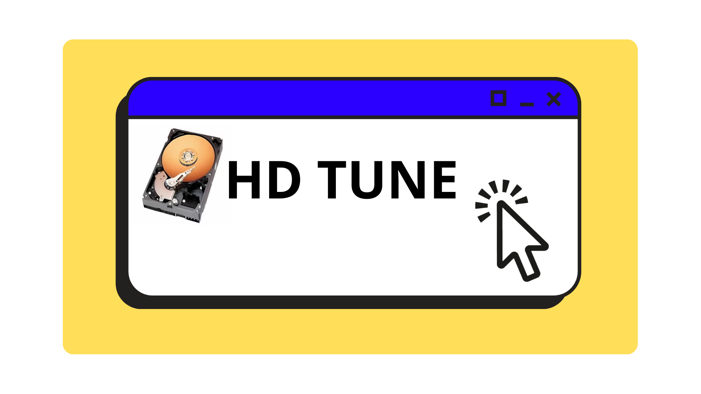
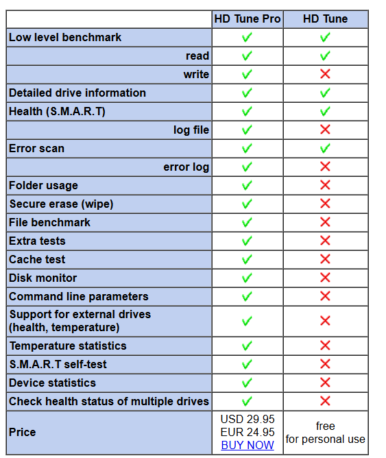
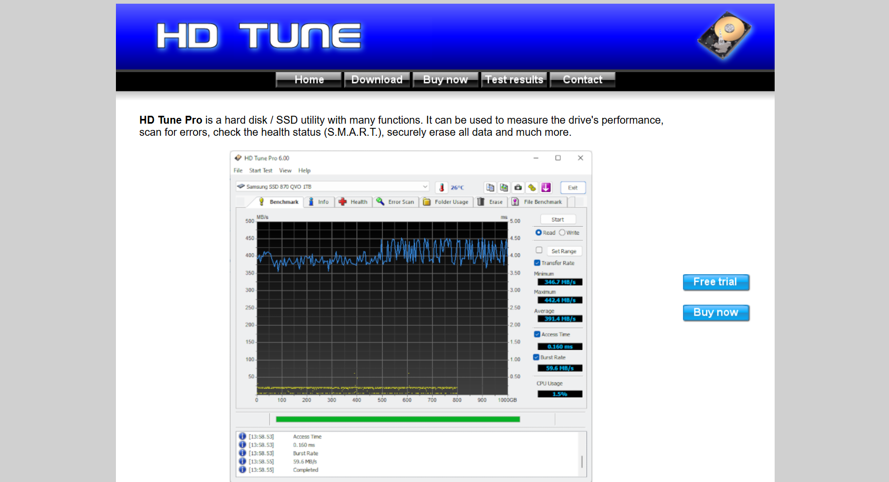
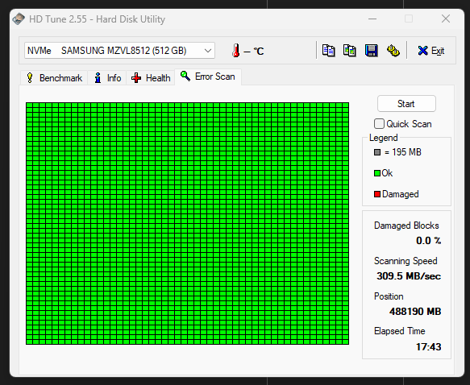
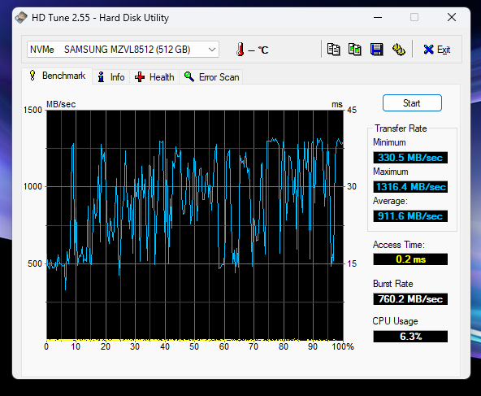

## ¿Qué es HD Tune?

### ☕ Análisis de almacenamiento

**HD Tune** es una utilidad ligera pero poderosa para **medir el rendimiento, verificar errores, monitorear la salud (S.M.A.R.T.) y revisar información del HDD o SSD**. Aunque existe una versión Pro con más funcionalidades, la versión gratuita cumple con muchas necesidades básicas.

---

### 🔧 ¿Para qué sirve HD Tune?

HD Tune es ideal para tareas relacionadas con el almacenamiento, incluyendo:

| Función                                | Descripción                                                                 |
| ----------------------------------------- | ------------------------------------------------------------------------------ |
| **Benchmark**                     | Mide la velocidad de transferencia del disco a lo largo del tiempo.          |
| **Health (Salud del disco)**      | Muestra los datos S.M.A.R.T. para ver el estado actual del disco.            |
| **Error Scan**                    | Escanea la superficie del disco en busca de sectores dañados.               |
| **Info (Información del disco)** | Proporciona detalles como el modelo, firmware, número de serie y capacidad. |
| **Temperatura**                   | Muestra la temperatura actual del disco en tiempo real.                      |

### 🎯 ¿Cuándo usar HD Tune?

* Si quieres **verificar la salud** de tu disco duro o SSD.
* Cuando tu sistema tiene **problemas de lentitud o archivos corruptos**.
* Si escuchas ruidos extraños o experimentas **bloqueos frecuentes**.
* Antes de vender o comprar un disco de segunda mano, para **comprobar su estado**.
* Para comparar el rendimiento de tu unidad frente a otras.

---

### 🔧 ¿Cómo instalar HD Tune?

Puedes descargar HD Tune desde su sitio oficial (o dando clic al enlace de abajo):

> [Descarga HD Tune ⚙️ ](https://www.hdtune.com/download.html)

Selecciona la versión gratuita o Pro según lo que necesites. En esta guia se ha descargado la versión gratuita el cual será un archivo con extensión ".exe":

Cuando abras el programa, verás una interfaz sencilla con varias pestañas:

> * **Benchmark:** Prueba de velocidad del disco.
> * **Info:** Detalles técnicos del disco.
> * **Health:** Datos de salud S.M.A.R.T.
> * **Error Scan:** Escaneo completo del disco.
> * **Temperature:** Muestra la temperatura actual.

Sin embargo, para la versión gratuita solo se podrá utilizar el **Benchmark y el Error Scan**

---

### Ejemplo de un escaneo de errores y benchmark:

Selecciona la pestaña “Error Scan” y haz clic en **Start**. El programa empezará a comprobar cada sector. Los sectores dañados aparecerán en **rojo**.

Cuando realices un examen de benchmark aparecerá los megabytes por segundo, el rango de transferencia y cuanto CPU utiliza.

---

#### 🎯 ¿HD Tune es recomendable?

**Sí, HD Tune es muy recomendable**, sobre todo si quieres **detectar problemas con tu disco antes de que sea demasiado tarde**. Es una herramienta liviana, rápida y muy fácil de usar.

##### ¿Para qué tipo de usuarios está pensado? 🐸

* [ ] **Usuarios con problemas de rendimiento:** Si tu PC va lenta o los archivos se dañan, puedes usar HD Tune para comprobar si el disco es el culpable.
* [ ] **Técnicos y reparadores:** Ideal para diagnosticar fallos en discos antes de decidir si es necesario reemplazarlos.
* [ ] **Compradores/vendedores de hardware usado:** Permite verificar el estado real de un disco duro o SSD antes de hacer una compra/venta.

---

##### ¿Merece la pena la versión de pago? 💵

La versión gratuita es **perfectamente funcional para la mayoría de los usuarios**, pero si buscas más herramientas, la **versión Pro** de HD Tune ofrece:

> * **Pruebas de lectura y escritura avanzadas.**
> * **Escaneo de errores más detallado y rápido.**
> * **Monitoreo del rendimiento en tiempo real.**
> * **Exportar datos e informes.**

##### La versión Pro está pensada para usuarios como: 🐸

* [ ] Técnicos que hacen **diagnóstico frecuente de discos** .
* [ ] Empresas que necesitan **revisión y mantenimiento periódico de discos** .
* [ ] Usuarios avanzados que desean **más control sobre el análisis** de sus unidades.

