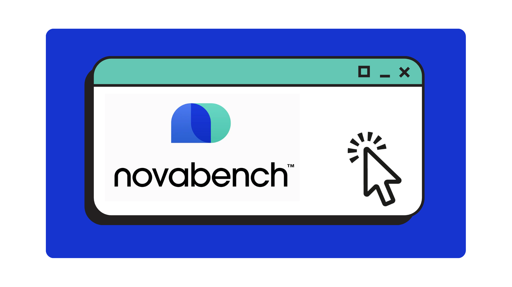
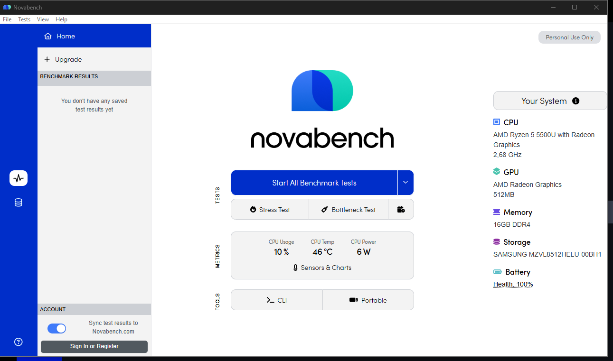
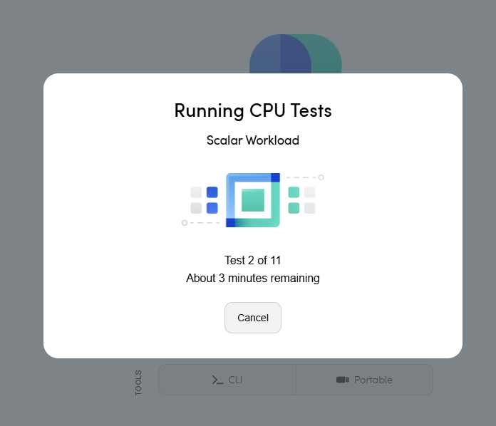
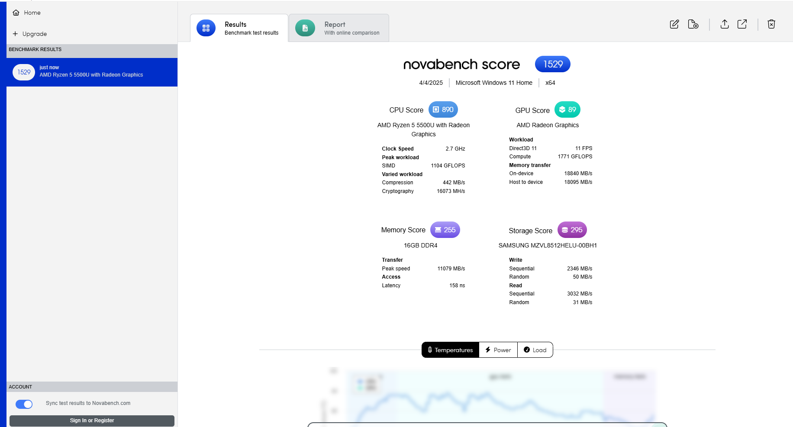
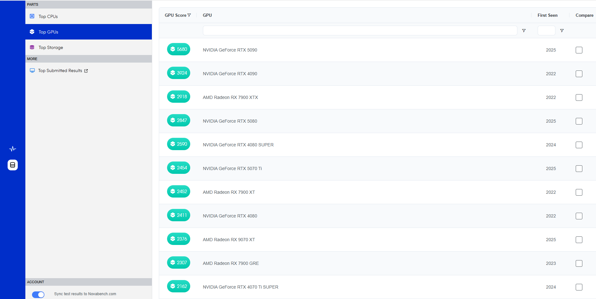

## ¿Qué es Novabench? 🦭

### ☕ Herramienta de diagnostico general

**Novabench** es un programa gratuito, aunque también posee su versión de pago, que permite **evaluar el rendimiento general de tu sistema** en solo unos minutos. Es ampliamente utilizado para **comparar resultados, detectar cuellos de botella y verificar estabilidad** después de cambios o mantenimiento.

### 🔧 ¿Para qué sirve Novabench?

| Componente                  | Prueba que realiza                                                                     |
| ----------------------------- | ---------------------------------------------------------------------------------------- |
| **CPU**               | Mide el rendimiento en cálculos matemáticos y operaciones de enteros/flotantes.      |
| **GPU**               | Ejecuta pruebas gráficas (Direct3D) para estimar su potencia en procesamiento visual. |
| **RAM**               | Evalúa la velocidad de lectura/escritura de la memoria.                               |
| **Almacenamiento** | Prueba la velocidad de lectura/escritura secuencial.                                   |

---

### 🎯 ¿Cuándo usar Novabench?

* Si quieres **saber qué tan rápido es tu PC** en comparación con otros.
* Después de hacer upgrades de hardware (como cambiar SSD, RAM o CPU).
* Para **detectar problemas de rendimiento** en algún componente.
* Para crear un historial de rendimiento y ver si hay **degradación con el tiempo**.-

---

### 🎓 ¿Cómo instalar Novabench?

Puedes descargar Novabench desde su página oficial:

> [Descargar Novabench 🧖‍♂️](https://novabench.com)

Al ingresar, selecciona tu sistema operativo y descarga el instalador. Ejecuta el archivo con extensión .msi y sigue los pasos de instalación.

Una vez instalado y abierto, verás una interfaz moderna con opciones como:

> * **Start all Benchmark Tests:** Ejecuta el benchmark completo del sistema.
> * **View Results:** Consulta tus resultados y compáralos online.
> * **System Info:** Muestra información detallada del hardware.

---

### 📊 Ejemplo de resultado de prueba:

Luego de hacer clic en **Start all Benchmark Tests**, el programa correrá los tests en pocos minutos y te mostrará algo como esto:

Podrás ver tu puntuación global y desglosada por cada componente.

Además, podrás **compararte con otros usuarios** en la base de datos online o visualizar más a detalle componentes y los que estan en auge.

----

#### ¿Novabench es recomendable?🎯

**Sí, es una herramienta muy recomendable** si buscas una forma fácil y rápida de testear tu PC. Aunque no es tan profunda como otras herramientas de benchmarking, es ideal para **usuarios que quieren resultados rápidos y comparables.**

##### ¿Para qué tipo de usuarios está pensado? 🐸

* [ ] **Técnicos o ensambladores:** Para comprobar que los componentes están funcionando correctamente luego del armado o reparación.
* [ ] **Gamers o creadores de contenido:** Que necesitan asegurarse de que su hardware rinde lo necesario para sus tareas.
* [ ] **Usuarios que realizan upgrades frecuentes:** Que buscan evaluar el impacto real de sus mejoras.
* [ ] **Usuarios con problemas de rendimiento:** Para comparar su sistema actual con el promedio y detectar posibles fallos.

---

#### ¿Vale la pena la versión Pro?

La versión gratuita es suficiente para la mayoría, pero la versión Pro ofrece:

> * **Historial de pruebas** con comparación gráfica.
> * **Tests automatizados programables.**
> * **Exportación de resultados y reportes detallados.**
> * **Monitoreo continuo del rendimiento del sistema.**

##### La versión Pro es ideal para usuarios como: 🐸

* [ ] **Profesionales de IT** que desean llevar control del rendimiento de múltiples equipos.
* [ ] **Usuarios avanzados** que hacen upgrades y necesitan comparaciones más precisas.
* [ ] **Empresas** que desean monitorear el estado de las estaciones de trabajo.
* [ ] **Técnicos** que desean realizar benchmarking automatizado.
* [ ] **Analistas** que requieren informes exportables y seguimiento a largo plazo.

--- 

