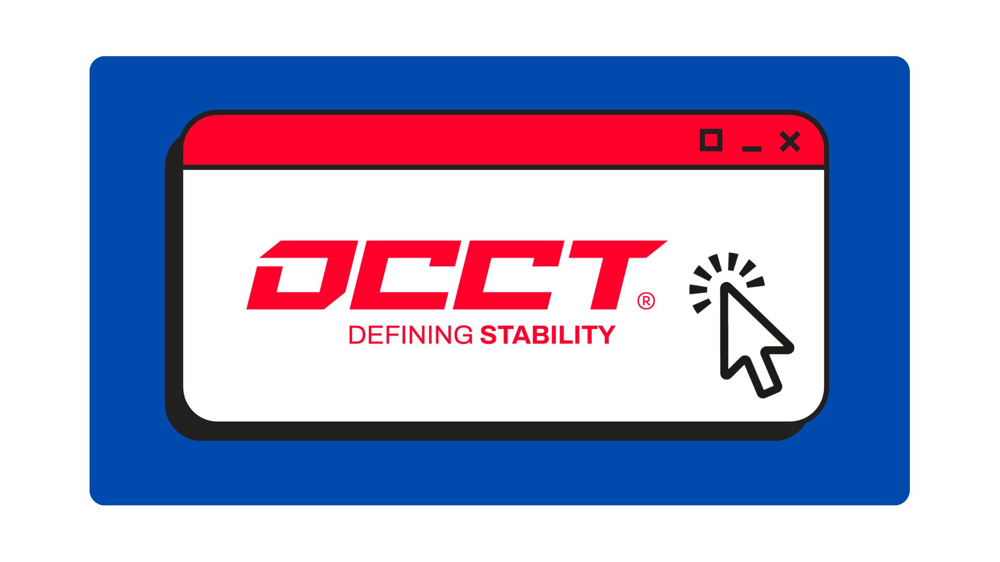
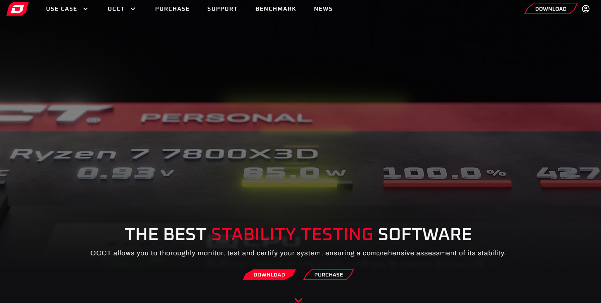
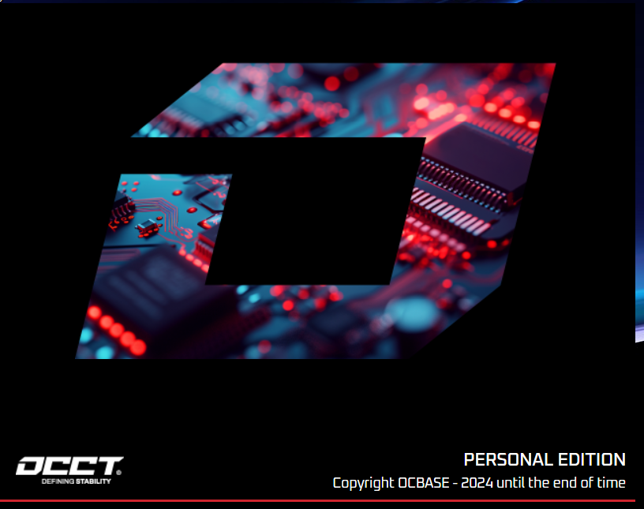
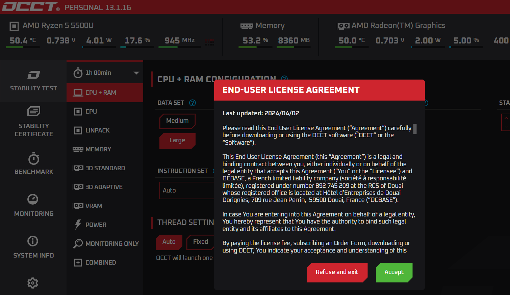
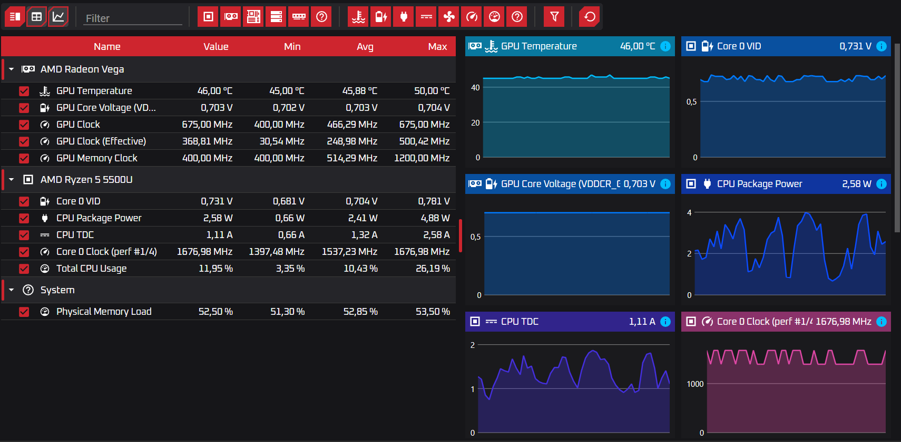
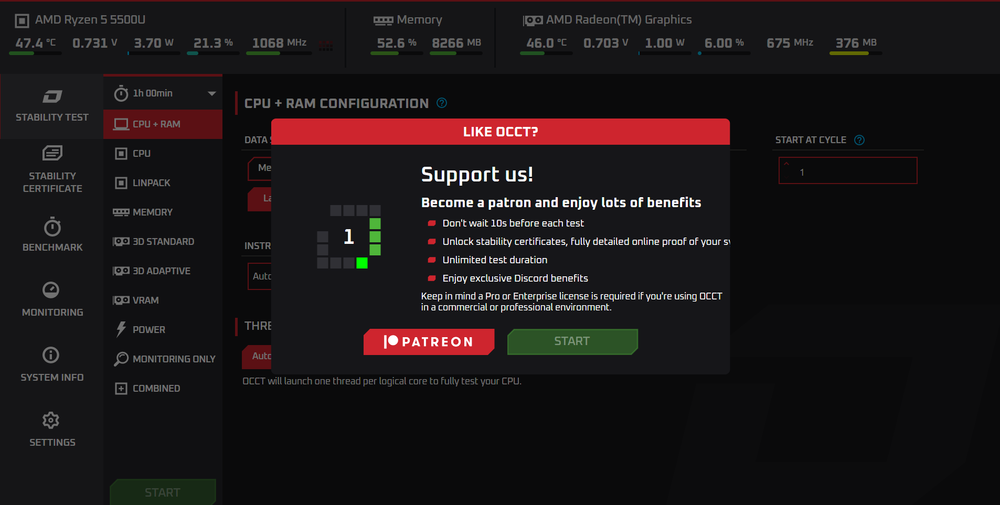
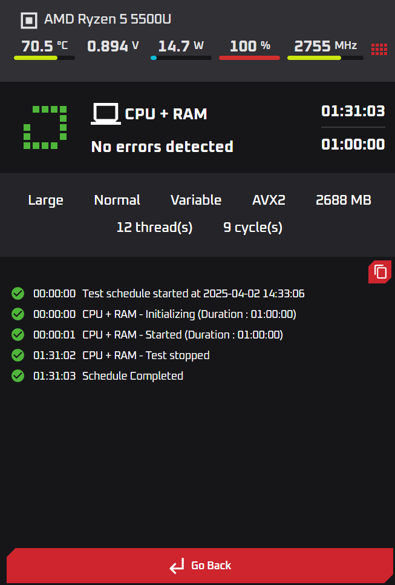

## ¿Qué es OCCT? 🦜

### ☕ Herramienta de GPU, CPU y RAM

**OCCT** significa **OverClock Checking Tool** , y es una herramienta gratuita, aunque también tiene una versión de pago. Esta herramienta esta siendo muy popular para **testear la estabilidad de tu hardware** , sobre todo cuando haces **overclocking** o necesitas verificar si tu sistema está funcionando bien bajo carga intensa.

### 🔧 ¿Para qué sirve OCCT?

OCCT se usa principalmente para:

| Componente                         | Prueba que realiza                                                                |
| ------------------------------------ | ----------------------------------------------------------------------------------- |
| **CPU**                   | Test de estrés para comprobar estabilidad y temperaturas.                        |
| **RAM**                   | Detectar errores de memoria.                                                      |
| **Fuente de alimentación ** | Ver si tu fuente mantiene el voltaje estable bajo carga.                          |
| **GPU**                   | Test de estrés gráfico para ver temperatura y rendimiento.                      |
| **Monitorización**     | Muestra en tiempo real temperaturas, voltajes, frecuencias, y uso de CPU/GPU/RAM. |

---

### 🎯 ¿Cuándo usar OCCT?

* Cuando estás **haciendo overclock** y quieres probar estabilidad.
* Si tu PC **se reinicia o apaga sola** bajo carga.
* Para comprobar si hay problemas de **temperatura** o **voltaje** .
* Antes de comprar una nueva fuente, para ver si la actual está fallando.

## 🐢 ¿Como instalar OCCT?

Dirigete a la página principal de OCCT (O dale click en este enlace)

> [Descarga aqui OCCT 🦎 ](https://www.ocbase.com/)

Al entrar en el enlace, le daras a "Download".

Una vez descargado el programa, siendo la extensión ".exe" lo iniciaremos de manera que debe salir una pestaña pequeña.

Al cargar esa pestaña, el programa habrá iniciado y podremos observar distintas pestañas:

> - Stabily Test: Realizará un examen de la CPU, GPU y la RAM.
> - Benchmark: Realizará un examen para medir la velocidad, eficacia, rendimiento...
> - Monitoring: Podremos ver un montón de detalles junto con las graficas para ver el rendimiento de distintos componentes.
> - Información del sistema.
> - Configuración: Una breve configuración del programa.

### 📊 Ejemplo de un escaneo de errores y benchmark:

Cuando realicemos uno de cualquier test posibles, nos dirá que realizará una cuenta atrás y mientras lo realizamos podemos observar si el funcionamiento del sistema es correcto o proporciona errores.

Una vez realizado el examen, te dirá si existen errores, cuantos ciclos ha realizado y el tiempo que ha estado realizando el examen.

---

#### 🎯 ¿OCCT es recomendable?

Sí, **OCCT es altamente recomendable** para aquellos usuarios que deseen realizar pruebas exhaustivas de estabilidad y estrés en su hardware. Es una herramienta potente y confiable para identificar problemas que podrían no manifestarse en un uso diario normal.

##### ¿Para que tipo de usuarios esta pensado? 🐸

* [ ] **Usuarios que experimentan inestabilidad:** Si tu PC sufre cuelgues, reinicios inesperados o errores, OCCT puede ayudar a identificar si el problema está relacionado con la estabilidad del hardware bajo carga.
* [ ] **Técnicos y ensambladores de PC:** Para realizar pruebas de estrés en sistemas recién ensamblados o reparados, asegurando su fiabilidad antes de entregarlos a los clientes.
* [ ] **Overclockers:** Para verificar la estabilidad del sistema después de aplicar overclocking a la CPU, GPU o memoria RAM. Permite asegurar que los componentes puedan soportar cargas elevadas sin fallos ni sobrecalentamiento.

---

##### ¿Merece la pena la versión de pago?  💵

La **versión gratuita de OCCT es bastante completa y funcional** para la mayoría de los usuarios. Permite realizar pruebas de estrés en los componentes principales y monitorizar los sensores. Sin enbargo, la **versión de pago (Pro)** ofrece funcionalidades adicionales como:

> * **Pruebas automatizadas:** Permite crear y ejecutar secuencias de pruebas personalizadas.
> * **Informes detallados:** Genera informes más completos y personalizables sobre las pruebas realizadas.
> * **Uso comercial:** Permite utilizar OCCT con fines comerciales.
> * **Soporte prioritario:** Acceso a un soporte técnico más rápido.

##### La versión de pago podria ser para usuarios 🐸:

* [ ] Eres un**profesional** que necesita realizar pruebas de estrés de forma regular y generar informes detallados.
* [ ] Necesitas la funcionalidad de**pruebas automatizadas** para realizar análisis más complejos.
* [ ] Necesitas utilizar OCCT con**fines comerciales** .

---

