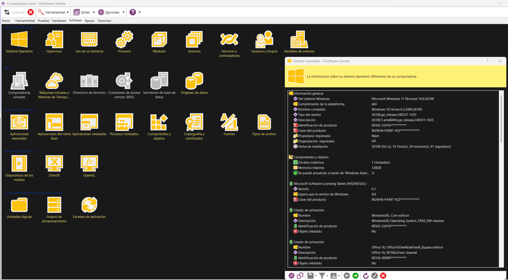

## ¿Qué es SiSoftware Sandra Lite? 🐓

### ☕ Herramienta de diagnostico general

**SiSoftware Sandra Lite** (System ANalyser, Diagnostic and Reporting Assistant) es un software gratuito con versión de pago, diseñado para realizar **análisis detallado del hardware y software de tu sistema**. Es ideal para usuarios que desean ir más allá de un simple test de rendimiento.

### 🔧 ¿Para qué sirve SiSoftware Sandra Lite?

| Componente                | Prueba o función que realiza                                                       |
| --------------------------- | ------------------------------------------------------------------------------------- |
| **CPU**             | Benchmark de operaciones aritméticas, multimedia y encriptación.                  |
| **GPU**             | Pruebas de procesamiento GPGPU (OpenCL, CUDA) y capacidad de cálculo.              |
| **RAM**             | Test de ancho de banda, latencia y eficiencia.                                      |
| **Disco (HDD/SSD)** | Pruebas de lectura/escritura, acceso aleatorio y rendimiento bajo carga.            |
| **Placa base**      | Información detallada del chipset, sensores, y buses.                              |
| **Red**             | Prueba de velocidad de transferencia y eficiencia de red local o Internet.          |
| **Sistema**         | Muestra información detallada sobre el sistema operativo, servicios, drivers, etc. |

---

### 🎯 ¿Cuándo usar SiSoftware Sandra Lite?

* Cuando necesitas una **visión técnica y detallada del hardware y software**.
* Si eres técnico y deseas verificar el **estado real de un equipo** que vas a reparar.
* Para realizar **benchmarks profesionales** y comparaciones entre equipos.
* Cuando trabajas con procesamiento científico, IA o cálculos complejos y deseas saber si el sistema está bien optimizado.

## 🎓 ¿Cómo instalar SiSoftware Sandra Lite?

Puedes descargarlo desde su web oficial:

> [Descargar Sandra Lite 🧠](https://sisoftware-sandra-download.com)

Selecciona la versión gratuita y compatible con tu sistema operativo. Luego sigue los pasos del asistente de instalación.

Una vez abierto, verás un menú con múltiples opciones agrupadas:

> * **Benchmarking:** Ejecución de pruebas de CPU, GPU, RAM, disco, red...
> * **Hardware:** Información detallada de cada componente físico.
> * **Software:** Datos de sistema, servicios, bibliotecas, controladores, etc.
> * **Dispositivos conectados:** Información sobre impresoras, USB, almacenamiento externo, etc.

---

### 📊 Ejemplo de resultado de prueba:

Después de elegir una prueba, Sandra Lite ejecutará análisis avanzados y mostrará gráficos, tablas comparativas e información técnica extensa.

---

### 🎯 ¿Sandra Lite es recomendable?

**Sí, es muy recomendable** para usuarios que necesitan un análisis profundo del sistema y no se conforman con pruebas básicas. Aunque la curva de aprendizaje es un poco más alta, **la información que proporciona es sumamente útil para diagnósticos profesionales.**

#### ¿Para qué tipo de usuarios está pensado? 🐸

* [ ] **Técnicos profesionales:** Que necesitan diagnósticos detallados del estado del hardware y software.
* [ ] **Ingenieros o analistas de rendimiento:** Que deben evaluar sistemas para tareas críticas como renderizado, simulaciones o IA.
* [ ] **Usuarios avanzados o entusiastas del hardware:** Que quieren conocer el funcionamiento interno de su PC.
* [ ] **Empresas de soporte técnico o mantenimiento informático:** Que requieren herramientas confiables y detalladas.
* [ ] **Usuarios que montan o prueban estaciones de trabajo personalizadas:** Donde el rendimiento debe ser validado exhaustivamente.

---

#### 💵 ¿Vale la pena la versión Pro?

La versión gratuita ya es poderosa, pero la Pro incluye:

> * **Pruebas avanzadas y automatizadas.**
> * **Soporte para redes empresariales y análisis remoto.**
> * **Informes exportables y resultados comparativos en profundidad.**
> * **Actualizaciones frecuentes y soporte técnico premium.**

### La versión Pro es ideal para usuarios como: 🐸

* [ ] **Profesionales de IT** que trabajan en entornos corporativos.
* [ ] **Empresas** que requieren auditorías o monitoreo constante de sistemas.
* [ ] **Técnicos** que dan soporte a múltiples clientes y necesitan reportes completos.
* [ ] **Instituciones educativas o centros de investigación** que trabajan con hardware exigente.

---

